# S32 Design Studio (S32DS) for Programming NXP DEVKIT-MPC5748G Microcontroller

## S32DS Installation Problems

- Unsupported OS; currently supported:
    - Microsoft Windows 7/8/10 (64-bit) 
    - ~~Ubuntu 16.04 (64-bit)~~ (limited capabilities w.r.t. processor expert)
    - ~~Debian 8 (64-bit)~~ (limited capabilities w.r.t. processor expert)
    - ~~CentOS 7 (64-bit)~~ (limited capabilities w.r.t. processor expert)
- Wrong IDE version; you *must* use: [**S32 Design Studio for Power
Architecture v2.1**](https://www.nxp.com/design/software/development-software/s32-design-studio-ide/s32-design-studio-for-power-architecture:S32DS-PA)

You can either stick to SDK version **3.0.0** or update to **3.0.3.**. 
Depending on the version, you may not be able to import our projects. 
Follow the steps below to **create all projects from scratch**.
After creating the project, add all the files in `Sources` or `src` to your own project (by copying their content).

## Issues with Importing Projects into S32DS

- S32DS seems to rely on certain default paths (e.g., to SDK) that will break
if not using default settings
- S32DS versions conflicts: 3.0.0 <-> 3.0.3 (we use the most up-to-date
version 3.0.3)

## Simple LED Project from Scratch

1. First create a new **S32DS Application Project** in S32DS:

    

2. Then, pick the right device (MPC5748G):

    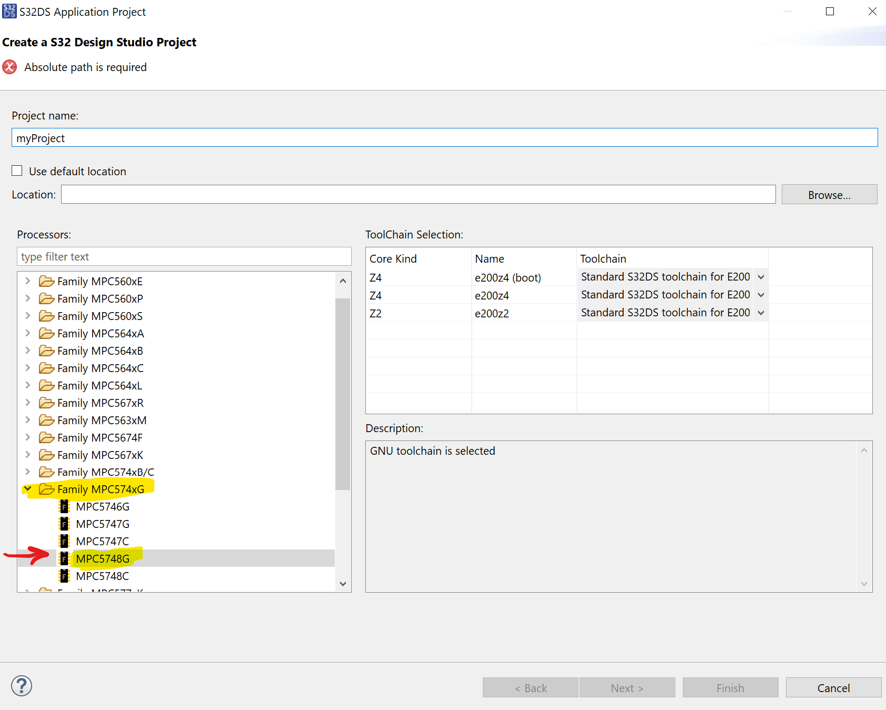

3. Select only one required core for this project:

    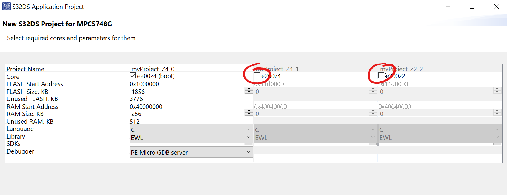 

## Interrupt Project from Scratch

Perform the following steps in addition to the steps for the **Simple LED
Project**.

1. Add an SDK to use:

    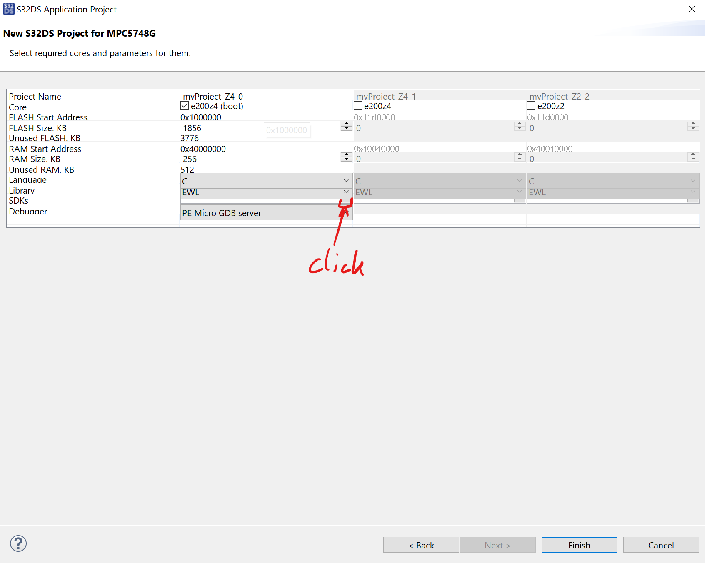

2. Select proper SDK:

    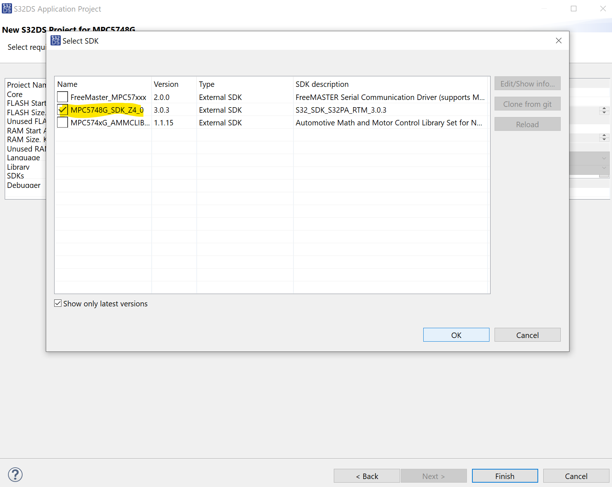

## TCP Project from Scratch

This project is created differently.
Follow these steps:

1. Create a new **S32DS Project from Example**:

    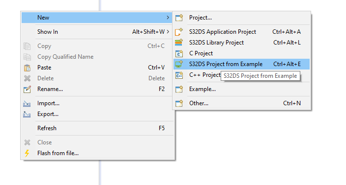

2. Pick the lwIP example project:

    

3. Remove FreeRTOS (an OS) from the project:

    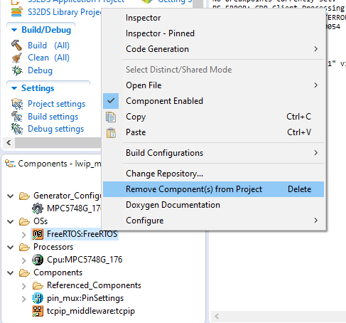

4. Open TCP/IP middleware component configuration:

    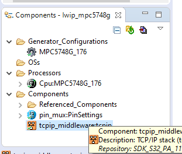

5. Define IP settings to include DHCP and at least IPv4 (depending on your
   S32DS version, this might look slightly different!):

    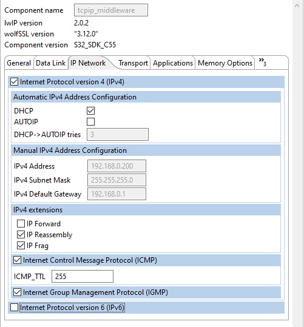

    Version 3.0.3 looks slightly different:

    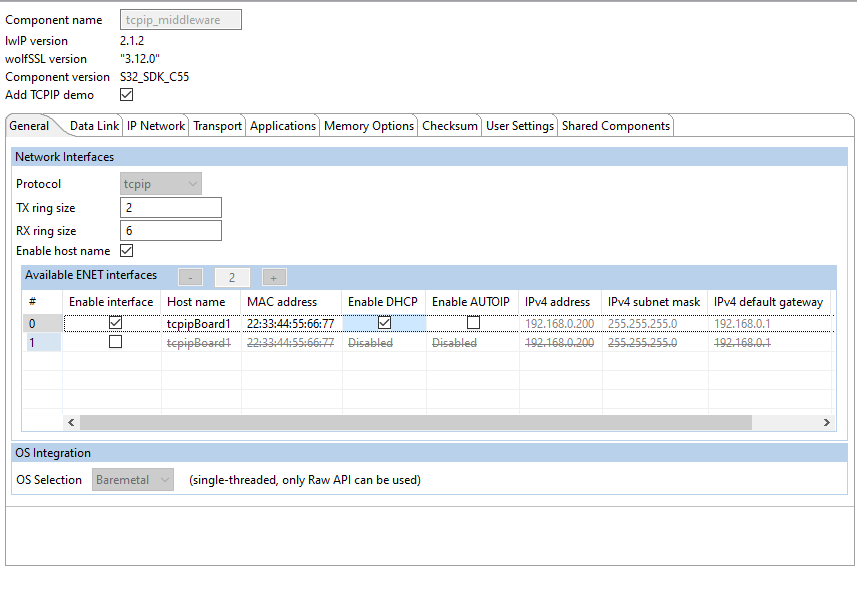
Note, do **not uncheck IPv6**!

6. Define lwIP API settings:

    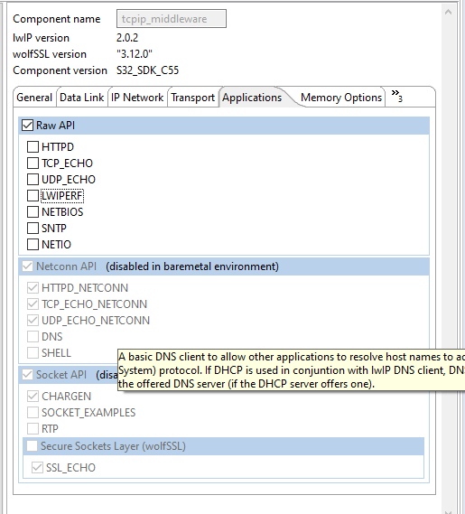

7. Save the TCP/IP configuration and re-generate SDK code:

    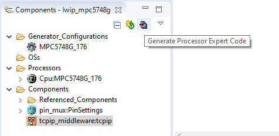

8. If using version 3.0.3 use the slightly different project [`ex_tcp_client_3_0_3`](https://gitlab.lrz.de/i4/teaching_public/winter-semester-2020/advanced-topics-of-software-engineering-2020/-/tree/master/exercise_02/ex_tcp_client_3_0_3) as a starter.

## Troubleshooting

- If connecting to the HTTP server does not work, **make sure to plug in an ethernet (LAN) cable!** This cable is **not** provided to you and no, the microcontroller does not automagically connect itself via WiFi or some other wireless protocol.

- If encountering issues with the component configuration, it is always a good
idea to **Reload Project** and **Generate Processor Expert Code** again:
  
    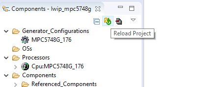

- If encountering issues with IP, please check that ethernet cable is properly
connected and you have DHCP activated in your TCP/IP component configuration.

- If (on version 3.0.3) you encounter that `netif` is not defined in
`tcp_client.c`, remove the `extern` keyword in front. 

    

- If (on version 3.0.3) you encounter that the `netif.ip_addr.addr` is not
available, please use `netif.ip_addr.u_addr.ip4.addr`.
  
    

- If you encounter problems with lwIP (e.g., TCP connection not established), check if you ran into one of the [**common pitfalls of lwIP**](https://www.nongnu.org/lwip/2_1_x/pitfalls.html).